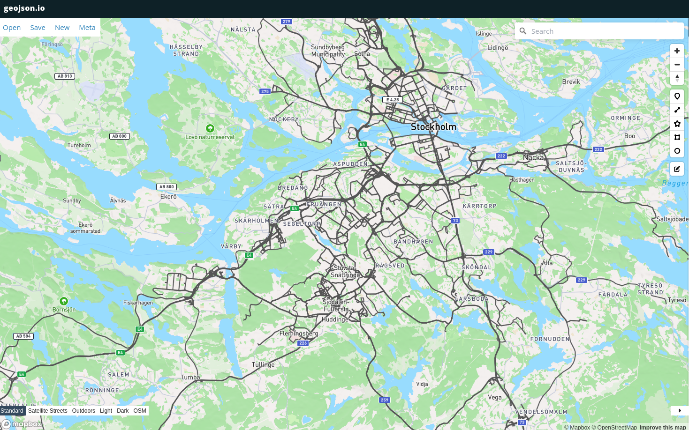

# Google Takeout Road Mapping

**Google Takeout Road Mapping** is a Python tool that processes Google Takeout location data, allowing you to filter routes by activity (e.g., driving), apply geofencing, snap routes to roads using OSRM, and output GeoJSON files for visualization. The tool also supports customizable line thickness for mapping tools.

## Features

- **Activity Filtering**: Filter routes based on specific activities (e.g., `IN_PASSENGER_VEHICLE` for car rides).
- **Geofencing**: Only include routes within a defined geographic area (center point and radius).
- **Date Range Filtering**: Limit routes to a specific time frame.
- **Road Snapping**: Snap routes to actual roads using the OSRM API.
- **GeoJSON Output**: Export the processed routes as a GeoJSON file for easy visualization.
- **Customizable Line Thickness**: Control the thickness of route lines in the GeoJSON file for better visualization.

## Prerequisites

- Python 3.7+
- `geojson` library for generating GeoJSON files
- `geopy` library for geospatial calculations
- `requests` library for making API calls to OSRM

### Installation

Install the required dependencies:

```bash
pip install geojson geopy requests
```

## Usage

### 1. Export Google Takeout Data

First, export your location data from [Google Takeout](https://takeout.google.com/settings/takeout). Make sure to include **Location History** in JSON format.

### 2. Run the Script

To process the location data, use the following command:

```bash
python process_takeout.py --folder-path ./Semantic_Location_History \
  --output-geojson snapped_routes.geojson \
  --activity-types IN_PASSENGER_VEHICLE \
  --from-date 2024-01-01 --to-date 2024-08-31 \
  --center-lat 59.3293 --center-lon 18.0686 --radius-km 30
```

### Command-Line Arguments

- `--folder-path`: Path to the folder containing your **Semantic Location History** files (JSON format).
- `--output-geojson`: Path to save the output GeoJSON file.
- `--activity-types`: Activity types to filter (e.g., `IN_PASSENGER_VEHICLE`, `WALKING`, etc.).
- `--from-date`: Start date for filtering routes (format: `YYYY-MM-DD`).
- `--to-date`: End date for filtering routes (format: `YYYY-MM-DD`).
- `--center-lat`: Latitude of the center point for geofencing.
- `--center-lon`: Longitude of the center point for geofencing.
- `--radius-km`: Radius (in kilometers) for geofencing.


### 3. Visualize the Output

Once the script processes your Google Takeout data, you can visualize the resulting GeoJSON using any mapping tool that supports GeoJSON, such as:

- [geojson.io](https://geojson.io/): An easy-to-use online tool for visualizing GeoJSON files.
- [QGIS](https://qgis.org/): A powerful open-source geographic information system that supports GeoJSON visualization.
- [Mapbox](https://www.mapbox.com/): A more advanced tool for custom map visualizations.
- [Leaflet](https://leafletjs.com/): A JavaScript library for interactive maps, which can be used in web applications.

Simply load the generated `snapped_routes.geojson` file into one of these tools to explore and analyze your filtered and snapped routes.


## 4. Example

Here's an example of processing Google Takeout data for routes where you were driving (`IN_PASSENGER_VEHICLE`), within a 30km radius of Stockholm, between January 1, 2024, and August 31, 2024:

```bash
python process_takeout.py --folder-path ./Semantic_Location_History \
  --output-geojson snapped_routes.geojson \
  --activity-types IN_PASSENGER_VEHICLE \
  --from-date 2024-01-01 --to-date 2024-08-31 \
  --center-lat 59.3293 --center-lon 18.0686 --radius-km 30
```

This will generate the snapped_routes.geojson file containing only the filtered and snapped routes within the specified parameters.

## 5. Example Map Visualization

Below is an example of the resulting map visualization after processing Google Takeout data and snapping routes to roads.



This image shows routes within a geofenced area, filtered by activity type and date range.


## 6. Contributing
Feel free to open issues or submit pull requests to improve the functionality of this tool.

## 7. License
This project is licensed under the MIT License. See the LICENSE file for more details.

